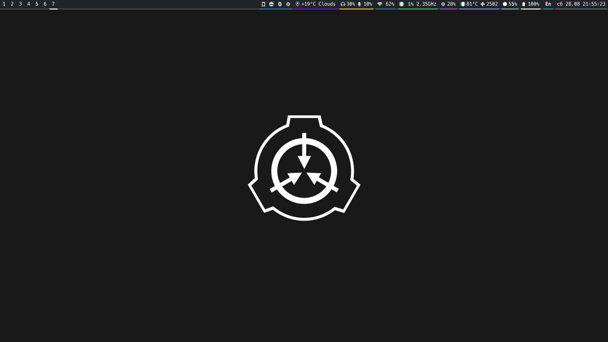
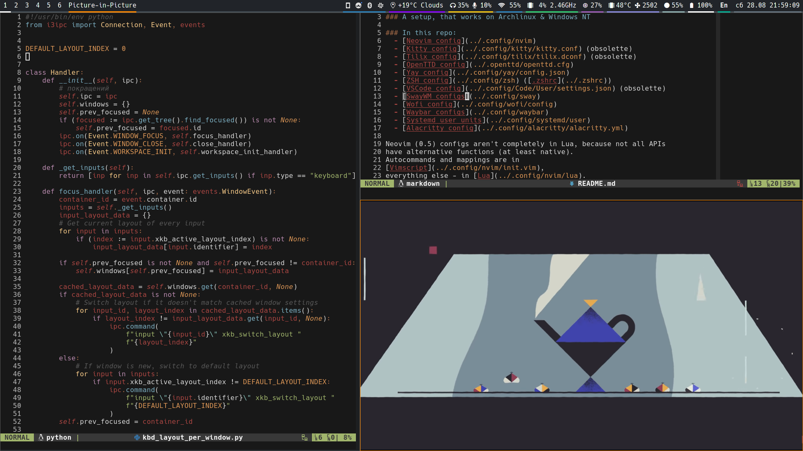
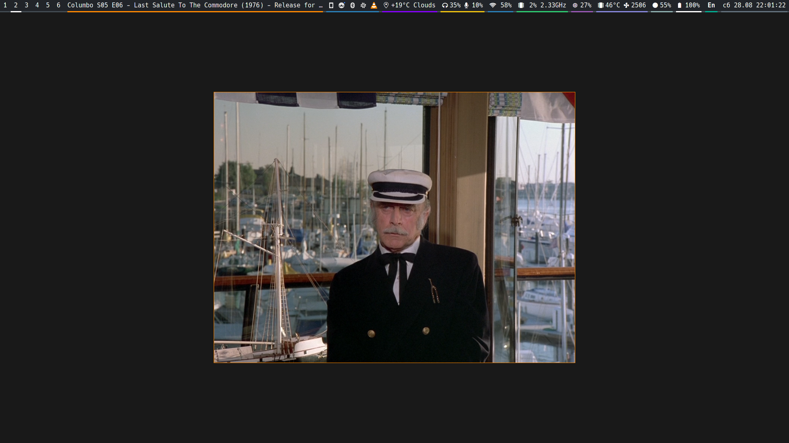
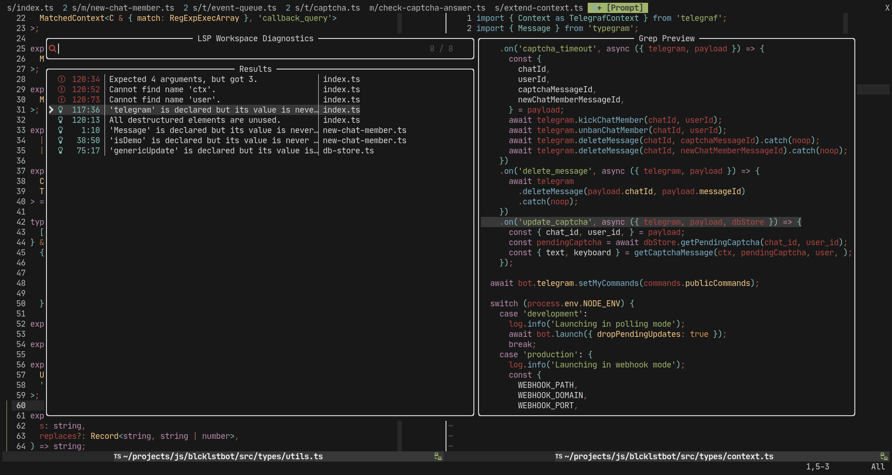

# [@krafterk28](https://github.com/kraftwerk28)'s dotfiles

### A setup, that sometimes breaks, but it works on my machine ©

### In this repo:
  - [Alacritty config](../.config/alacritty/alacritty.yml)
  - [Kitty config](../.config/kitty/kitty.conf) (obsolette)
  - [Mako config](../.config/mako/config)
  - [Neovim config](../.config/nvim)
  - [OpenTTD config](../.openttd/openttd.cfg)
  - [Pipewire & ALSA configs](../.config/pipewire)
  - [Sway configs](../.config/sway)
  - [Systemd user units](../.config/systemd/user)
  - [Tilix config](../.config/tilix/tilix.dconf) (obsolette)
  - [VSCode config](../.config/Code/User/settings.json) (obsolette)
  - [Waybar configs](../.config/waybar)
  - [Wofi config](../.config/wofi/config)
  - [Yay config](../.config/yay/config.json)
  - [ZSH config](../.config/zsh) ([.zshrc](../.zshrc))

Neovim (0.5) configs aren't completely in Lua, because not all APIs
have alternative functions (at least native).
Autocommands and mappings are in
[Vimscript](../.config/nvim/init.vim),
everything else - in [Lua](../.config/nvim/lua).

### Sway setup:

### Neovim setup:

